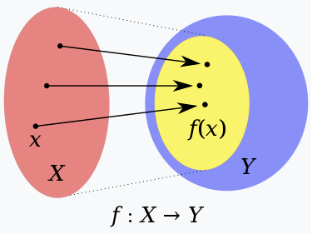

# 정의역(domain)

> 정의역이 $X$, 공역이 $Y$인 함수 $f$. $Y$안에 있는 노란색 집합은 $f$의 상 또는 치역이다.

**정의** : 수학에서 어떤 함수의 정의역은 함수가 어떤 값을 대응시키는지가 정의된 원소들로 구성된 [[집합]]이다.
- 함수 $f:X \rightarrow Y$는 집합 $X$의 각 원소에 대하여 $Y$의 한 원소를 대응시키는 수학적 대상이다. 이 경우 $X$를 $f$의 정의역이라고 한다, 반면, $Y$는 $f$의 `공역`이다.
- for example, 함수 $y=1.5x$에 대해 변수 $x,y$가 각각 $X=\{1,2,3\}, Y=\{1.5,3,4.5\}$의 원소(element)라고 할 때, 집합 $X$를 함수 $y=1.5x$의 정의역이라고 할 수 있다.  
# 공역(codomain, target set)
**정의** : 수학에서 어떤 함수의 공역은 이 함수의 값들이 속하는 집합이다.
- 함수 $f:X \rightarrow Y$는 집합 $X$의 모든 원소를 각각 집합 $Y$의 한 원소를 대응시키는 수학적 구조다. 이 경우 $Y$는 $f$의 공역이라고 한다. 반면, $X$는 $f$의 정의역이다

# 치역(range)
**정의** : 수학에서 어떤 함수의 치역은 그 함수의 모든 '출력'값의 집합이다. 다시 말해, 정의역의 상이다.
- 정의역이 $X$, 공역이 $Y$인 함수 $f : X \rightarrow Y$의 치역 $ran f$은 다음과 같은 공역의 부분집합임.
$$ran f = f(X) = \{f(x):x \in X\} \subset Y$$
- 치역과 공역이 같은 함수를 `전사 함수`라고 함. 일반적으로 치역과 공역은 다르다.
- '치역 $\subset$ 공역' 이지만 공역의 모든 원소들이 치역의 원소일 필요는 없다.
## 전사 함수(surjective function)
**정의** : 수학에서 전사함수는 공역과 치역이 같은 함수이다. $\rightarrow Y = f(X)$

# 상(image)
**정의** : 수학에서 상은 어떤 함수에 대한 정의역의 원소(들)에 대응하는 공역의 원소(들)이다.
- 정의역이 $X$, 공역이 $Y$인 함수 $f : X \rightarrow Y$를 생각했을 때, 정의역의 원소 $x \in X$의, 함수 $f$에 대한 **상**은 공역의 원소 $f(x) \in Y$이다.
- 반대로 원상(preimage) 또는 역상(inverse image)은 어떤 함수에 대한 공역의 원소(들)에 대응하는 정의역의 원소(들)이다.
- 역상 : $x \in X$