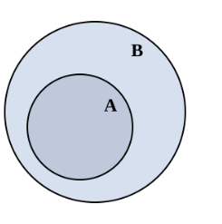
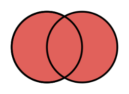
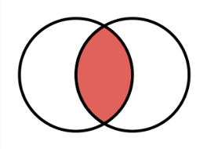
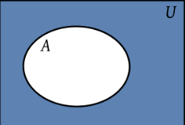
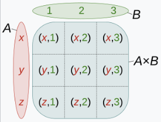

# 집합(set)
**정의** : 어떤 명확한 조건을 만족시키는 서로 다른 대상들의 모임

$$A : \{a,b,c,1,2,3\}$$
$$B : \{1,2,3\}$$
집합 A와 B와 각각의 원소(element)를 위와 같이 가정할 때 아래와 같이 표기함.

$$a,b,c,1,2,3 \in A$$
$$d \notin A$$
$$a,b,c \notin B$$

## 부분집합(subset)

위 가정에서 B를 A의 부분집합이라고 하고 $B \subset A$ 또는 $B \subseteq A$ 와 같이 표기
$B \subset A, A \subset B$ 이면 $A = B$, 역도 참

## 공집합(empty set)
**정의** : 아무런 원소를 가지지 않는 집합, 모든 집합의 부분집합 { } , $\emptyset$ 으로 표현
$\emptyset \in A, B...$

## 합집합(union)

**정의** : 둘 이상의 집합의 모든 원소를 한 군데 합쳐 놓은 집합
집합$C$를 {$1,2,5,6$}로 가정했을 때
$$B \cup C = \{1,2,3,5,6\}$$
이때 $B \cup C$에 속할 [필요충분조건](필요충분조건.md) 은 $x \in B, x \in C$ 

## 교집합(intersection)

**정의** : 집합론에서 ,두 집합 B와 C가 교집합 $B \cap C$는 그 두 집합이 공통으로 포함하는 원소로 이루어진 집합
- 위 가정에서 $B \cap C : \{1,2\}$ 가 성립
- $x \in B \cap C$ 일 [필요충분조건](필요충분조건.md)은 $x \in B$ and $x \in B$
- 두 집합에 교집합을 취하면 아무 원소도 남지 않게 되는 경우도 있는데 짝수와 홀수 각각의 집합의 교집합이 공집합 $\emptyset$ 인 것이 그 예시임
- 이런 두 집합을 서로소 집합이라고 함

## 여집합(complement set)

**정의** : 집합론에서, 집합 $A$의 여집합 $A^c$ 는, 전체집합 $U$의 원소 중 $A$의 원소가 아닌 것들의 집합
- $A^c$ = {$x \in U : x \notin A$} 
- $A^c \cap A$ = $U^c$ = $\emptyset$
- 임의의 $x \in U$ 에 대해, $x \in A^c$ 일 필요충분조건은 $x \notin A$ 

## 곱집합(product set)

**정의** : 집합론에서 곱집합 또는 데카르트곱은 각 집합의 원소를 각 성분으로 하는 튜플들의 집합
- $A * B$ = {$(a, b) | a \in A, b \in B$}