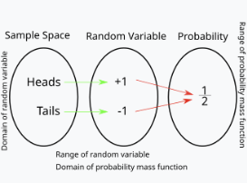
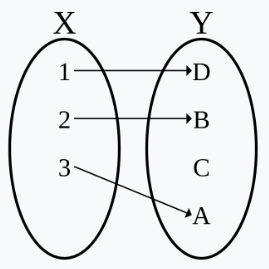

# 확률변수(random variable)
**정의** : 확률론에서 확률 변수는 `확률 공간`에서 다른 `가측 공간`(보통은 실수의 집합)으로 가는 가측함수이다. 시행의 결과에 따라 값이 결정되는 변수를 나타낸다. 

- 간단히 말해,  '무작위 현상을 숫자로 표현하는(**매핑**) 도구'
- 동전 던지기에서, 결과가 앞이면 +1점, 뒤면 -1점을 주는 **함수**를 생각
	- 표본공간 $Ω=\{H,T\}$
	- 확률변수 $X$를 다음과 같이 정의:
	- 이 $X$는 '동전 결과'를 '숫자'로 바꿔주는 역할을 함.

$$X(H) = +1, X(T) = -1$$

- 이렇게 정의된 $X$를 통해, " $X$ 가 +1이 될 확률"이나 " $X$ 가 -1이 될 확률" 같은 수치를 다룰 수 있게 됨
> Sample Space : set theory(랜덤 변수의 영역)
> Ranom Variable : set theory -> 수의 이론으로 넘어옴(확률 변수의 범위)
> Probability : 확률 3 공간. 전체 측도(확률)가 1인 확률공간(확률 질량 함수의 범위)

$ex.$ 동전 던지기
- 표본 공간(sample space)
	- '모든 가능한 결과'를 모아놓은 집합.
	- 동전을 한 번 던질 때의 표본 공간은 {앞(H), 뒤(T)}
- 사건(event)들의 모임
	- 표본 공간에서 일어날 수 있는 사건(부분집합)들을 모아둔 구조
	- `앞이 나온다` 는 {H}, `뒤가 나온다`는 {T} 같은 부분집합.
## 확률공간(probability space)
**정의** : 확률론에서 확률 공간은 전체 `측도`가 1인 측도 공간이다. 확률적인 현상에서, 확률공간의 측도는 `확률`을 정의한다.
$$\Pr(\Omega) = 1$$
$ex.$ 주사위를 던져 나오는 눈의 수를 추상화한 확률 공간 $(\Omega, \mathcal{F}, \Pr)$ 
- $\Omega = \{1,2,\dots,6\}$ $\rightarrow$ 각 경우의수의 원소($element$)
- $\mathcal{F} = \mathcal{P}(\{1,2,\dots,6\})$ $\rightarrow$ 경우의 수를 확률변수로 매핑
- $\Pr (\{1\}) = \Pr (\{2\}) = \Pr (\{3\}) = \Pr (\{4\}) = \Pr (\{5\}) = \Pr (\{6\}) = \frac{1}{6}$ $\rightarrow$ 매핑한 확률변수를 전체 측도(확률)가 1인 확률 공간으로 이동
### 확률(probability)  $p$
**정의** : 어떤 일이 일어날 가능성 또는 개연성. 비율이나 빈도로 측량해 나타낼 수 있음.
- 각 사건(부분집합)에 '얼마나 일어날 것 같은가?'라는 숫자(0이상 1 이하)를 할당하는 함수
- 모든 가능한 결과(표본공간 전체)에 대한 확률은 1이 되어야 함.
-  $p({H}) = 0.5, p({T}) = 0.5, p({H, T}) = 1$

### 측도(measure)
**정의** : 수학에서 측도는 특정 부분 집합에 대해 일종의 '크기'를 부여하며, 그 크기를 `가산개`로 쪼개어 계산할 수 있게 하는 함수이다. 측도의 개념은 `유한집합`의 원소인 수, 실수 구간의 길이(선분의 길이), 평면 도형의 넓이, 3차원 입체의 부피의 개념을 공통적으로 일반화한다. 측도가 부여된 집합을 **측도 공간**(measure space)이라고 한다.
- 어떤 집합의 부분집합마다 '크기'(길이, 넓이, 부피 등)를 부여할 수 있음
- 만약 집합을 겹치지 않는 여러 조각으로 나눌 수 있다면, 전체의 크기는 각 조각의 크기를 더한 값과 같아야 하는데 이 성질을 '**가산적**'이라고 부름
#### 가산 집합(countable set)
**정의** : 자연수의 집합으로의 `단사 함수`가 존재하는 집합을 말함. 가령 짝수의 집합은 무한집합이지만 각 짝수의 자연수에 순서대로 1:1 대응이 가능하므로 가산(셀 수있다)집합이다.

##### 단사 함수(injection function)

**정의** : 수학에서 단사 함수 또는 일대일 함수($one-to-one  function$)는 [정의역](정의역.md)의 서로 다른 원소를 공역의 서로 다른 원소로 대응시키는 함수이다. 공역의 각 원소는 정의역의 원소 중 최대 한 원소의 [상](정의역.md) 이다

## 가측 공간(measurable space)
**정의** : 측도론에서, 가측 공간은 가측 집합(measurable set)이라는 특별한 부분 집합들의 족이 부여돤 집합이다. 가측 집합들은 가산 합집합, 가산 교집합, 여집합에 대하여 닫혀 있다.
- 두 가측 공간 사이의 자연스러운 사상은 가측 함수라고 한다.